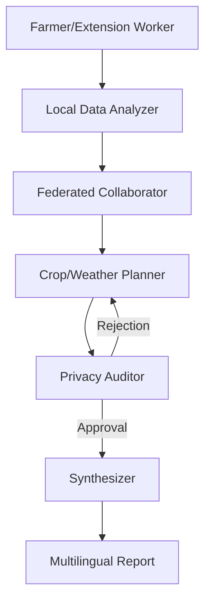

# Privacy-Preserving Multi-Agent Climate-Resilient Farming Advisor

A research-grade multi-agent system designed for Ethiopian smallholder farmers, focusing on climate resilience and privacy-preserving federated learning simulation.

## Architecture

The system uses **LangGraph** to orchestrate 5 specialized agents:

1.  **Local Data Analyzer**: Processes private farm data locally and extracts anonymized features.
2.  **Federated Collaborator**: Aggregates insights from a regional network of farms using Differential Privacy (DP).
3.  **Crop/Weather Planner**: Generates climate-resilient recommendations grounded in Ethiopian-specific data.
4.  **Privacy Auditor**: Monitors all flows for data leaks and ethical alignment.
5.  **Synthesizer**: Compiles final farmer-friendly reports in English, Amharic, and Afaan Oromoo.



## Features

- **Privacy-Preserving**: Uses Differential Privacy and Federated Learning simulation to ensure raw data never leaves the local agent.
- **Climate-Resilient**: Grounded in Ethiopian Ministry of Agriculture (MoA) guidelines and climate trends.
- **Multilingual**: Supports Amharic and Afaan Oromoo for local accessibility.
- **Research-Grade**: Includes benchmarking for privacy (membership inference attacks) and accuracy (utility vs. privacy).

## Setup

1.  **Clone the repository**:
    ```bash
    git clone <repo-url>
    cd ethio-climate-agri-advisor
    ```

2.  **Create a virtual environment**:
    ```bash
    python3 -m venv venv
    source venv/bin/activate
    ```

3.  **Install dependencies**:
    ```bash
    pip install -r requirements.txt
    ```

4.  **Set up environment variables**:
    Create a `.env` file with:
    ```env
    OPENAI_API_KEY=your_openai_key
    TAVILY_API_KEY=your_tavily_key
    ```

5.  **Run the demo**:
    ```bash
    python3 main.py
    ```

## Benchmarking

Run the evaluation scripts to see the system's performance:

```bash
python3 benchmarks/privacy_eval.py
python3 benchmarks/accuracy_eval.py
```

## References

- Digital Ethiopia 2030 Strategy
- Climate-Resilient Green Economy (CRGE) initiatives
- Federated Learning for Smart Agriculture (2025 trends)
