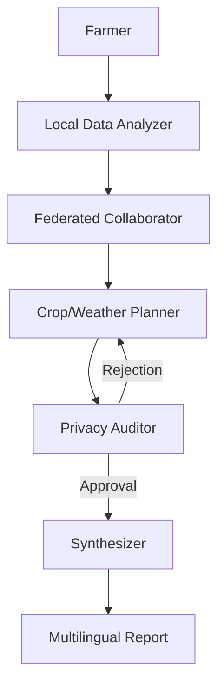

# Privacy-Preserving Multi-Agent Climate-Resilient Farming Advisor

## Project Overview
This project implements a multi-agent system designed to provide climate-resilient agricultural advice to Ethiopian smallholder farmers. It addresses the challenge of delivering personalized, data-driven insights while preserving the privacy of individual farm data. The system utilizes a federated learning simulation to aggregate regional insights without exposing raw user inputs.

## Objectives
- **Privacy Preservation**: Implement differential privacy and federated learning techniques to ensure data confidentiality.
- **Climate Resilience**: Provide recommendations based on regional climate trends and soil conditions, aligned with Ethiopian Ministry of Agriculture guidelines.
- **Accessibility**: Deliver outputs in multiple local languages (Amharic, Afaan Oromoo) to ensure usability for smallholders.

## System Architecture
The system is orchestrated using **LangGraph** and consists of five specialized agents:

1.  **Local Data Analyzer**: Securely processes user inputs locally to extract anonymized features.
2.  **Federated Collaborator**: Aggregates insights from a simulated network of farms using differential privacy.
3.  **Crop/Weather Planner**: Generates agricultural recommendations based on aggregated regional data and specific local conditions.
4.  **Privacy Auditor**: Monitors data flows to prevent privacy leaks and ensure ethical compliance.
5.  **Synthesizer**: Compiles the final report and translates it into local languages.

### Workflow


## Technology Stack
- **Language**: Python 3.10+
- **Orchestration**: LangGraph
- **LLM Integration**: LangChain, OpenAI GPT-4o
- **Search**: Tavily API
- **Privacy**: Custom Differential Privacy implementation (NumPy)

## Setup and Usage

### Prerequisites
- Python 3.10 or higher
- API Keys for OpenAI and Tavily

### Installation
1.  Clone the repository:
    ```bash
    git clone <repository_url>
    cd ethio-climate-agri-advisor
    ```
2.  Create and activate a virtual environment:
    ```bash
    python3 -m venv venv
    source venv/bin/activate
    ```
3.  Install dependencies:
    ```bash
    pip install -r requirements.txt
    ```
4.  Configure environment variables:
    Create a `.env` file in the root directory:
    ```env
    OPENAI_API_KEY=your_openai_key
    TAVILY_API_KEY=your_tavily_key
    ```

### Running the System
To run the advisor demo:
```bash
python3 main.py
```

## Evaluation
The project includes scripts to evaluate privacy guarantees and system accuracy:
- **Privacy Evaluation**: `python3 benchmarks/privacy_eval.py`
- **Accuracy Evaluation**: `python3 benchmarks/accuracy_eval.py`

## References
- Digital Ethiopia 2030 Strategy
- Climate-Resilient Green Economy (CRGE) Strategy
